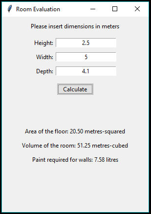

# room-challenge

## Software challenge for decorating a room

Python program to compute the area of the floor, volume of paint required to paint the walls and volume of the room; given the dimensions of the room. Assumes 2 coats of paint at 12sqm per litre, and that the ceiling is not to be painted.

## Installation

The application requires tkinter and Python 3, tkinter should be installed by default with Python 3. 

To run on windows, if git is installed, from command prompt type:

        git clone https://github.com/DKarandikar/room-challenge.git
        cd room-challenge
        python roomchallenge.py

Otherwise; download as zip from github directly, extract the files, and then open a command prompt in the directory containing roomchallenge.py and type the third line above.

To use with python 2.7 if that is all that is available open roomchallenge.py and change:

                7. import tkinter as tk
                8. from tkinter import ttk

to:

                7. import Tkinter as tk
                8. import ttk

The resulting window should be: 

If this is unsuccesful, ensure python 3 is installed correctly and added to the system path, so it can be called from the download directory

## Example Usage

Insert positive, real numbers into the entry boxes for height, width and depth. Press the calculate button and then the area, volume and quantity of paint required should be displayed at the bottom

For example: 

## Changelog

### [0.1.2] - 25-01-2017
- Moved error messages to own method inside the main app in roomchallenge.py
- Expanded docstring on app to summarise attributes
- Added comments to explain error message and paint assumptions

### [0.1.1] - 25-01-2017
- Updated README with installation, usage and changelog sections
- Ensured only positive values are accepted as dimensions of the room

### [0.1.0] - 25-01-2017
- Changed README to describe project
- Removed setup.py as nothing will be installed, only one file will run
- Implemented main functionality of roomchallenge, including the app window, button to calculate and the necessary entry and label widgets to perform such actions

### [0.0.1] - 25-01-2017
- Initial setup of readme, setup and roomchallenge files
